## Executive conclusion

**MEASURED:** The current board passes all nine declared connector-direction checks and all three model-registration groups. **OWED:** confirm that the visible mouths, top mounting side, keying and cable approaches match the intended use. No human approval has been recorded.

| Connectors | Intended cable approach | Mounting |
|---|---|---|
| J1–J4 | From the north edge | Top side |
| J5–J8 | From the south edge | Top side |
| J9, 12 V input | From the west edge | Top side |
| J10–J11, Samtec headers | Vertical entry; no planar edge direction | Top side |

The two elevated views show both edge rows and the backs that the straight-on inside views partly obscure. Camera position changes between the images; the board itself is unchanged.

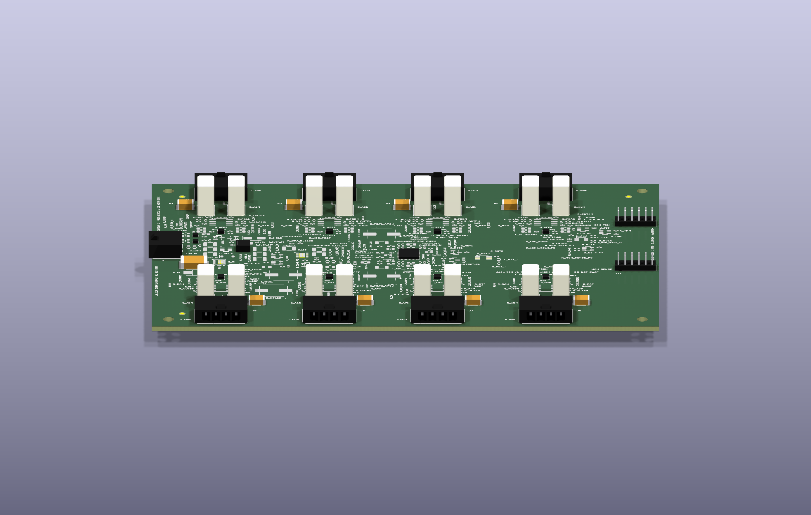

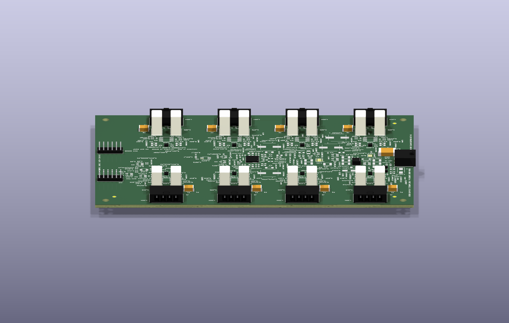

## Question and scope

**OWED:** approve or correct the visible connector orientation for this exact board. This decision concerns mouth direction, mounting side, keying and cable approach. The models include illustrative internal details and do not establish physical mating tolerances, cable-service clearance or first-article performance.

## Evidence boundary

**MEASURED:** board SHA-256 `7765810d8f9734f0ff893f7411ae80628ccddf5e78a78ee920a3303e9d2a8631`; orientation subject `57c3e2ab12381014391dd1258ba6762681e0e460e5826b92604649a1547a5715`. All eleven J references are accounted for: nine directional checks and two explicit vertical-entry exemptions. Repeated instances share one representative only where model, transform, mounting side, rotation, edge and orientation contract match. Native model registration separately covers all eleven references.

Images below are unchanged copies of the owning gate's exact review images. Green arrows identify intended cable access, and the top-view magenta box identifies footprint geometry. Straight-on J1/J5 inside images include the nearer opposite connector row; use the elevated views above to inspect the selected row's rear. Do not interpret the nearer row's mouth as the selected connector's back.

## Findings

**MEASURED — north row, representative J1 (J1–J4):** four contact openings, end keying chamfers and upper latch are visible from the cable side. The mouths point north. The mating plane is 2.08 mm inside the board edge, within the drawing-derived permitted range.

| Top | Cable side | Inside camera |
|---|---|---|
| 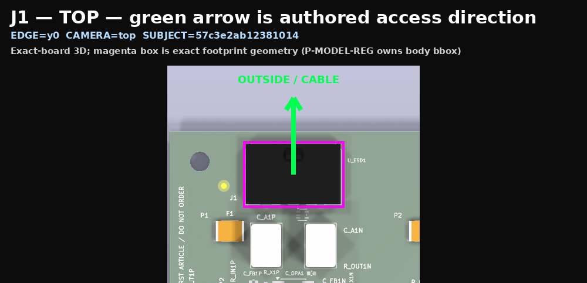 | 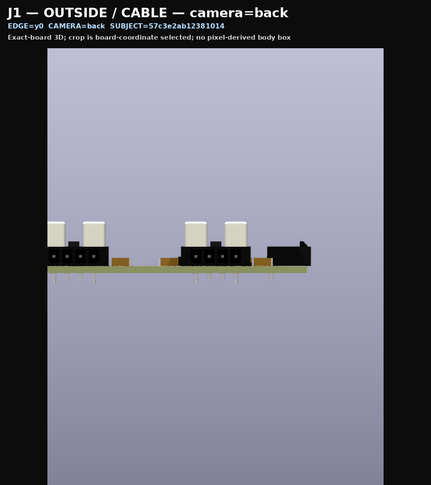 | 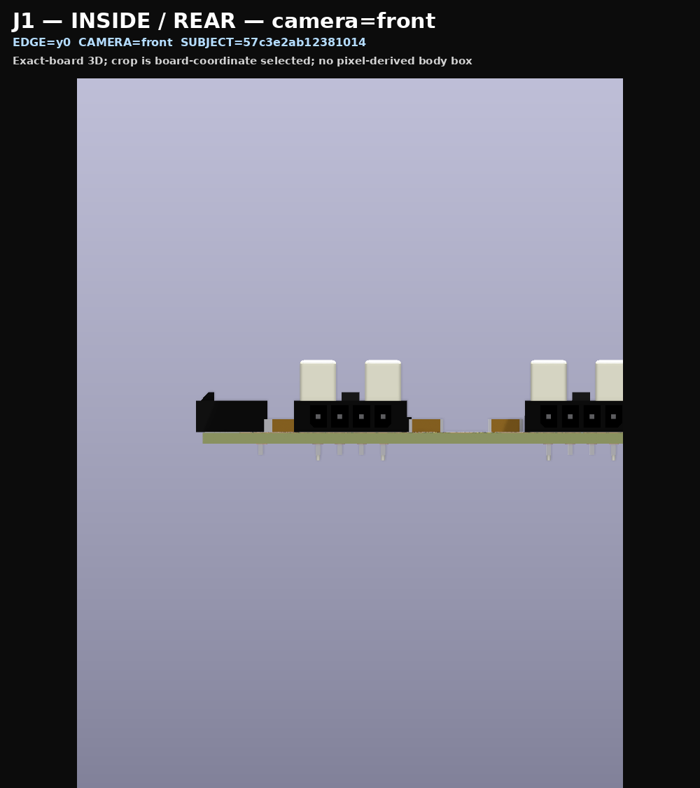 |

**MEASURED — south row, representative J5 (J5–J8):** the same exact model is rotated to point south. The mating plane is also 2.08 mm inside the board edge.

| Top | Cable side | Inside camera |
|---|---|---|
| 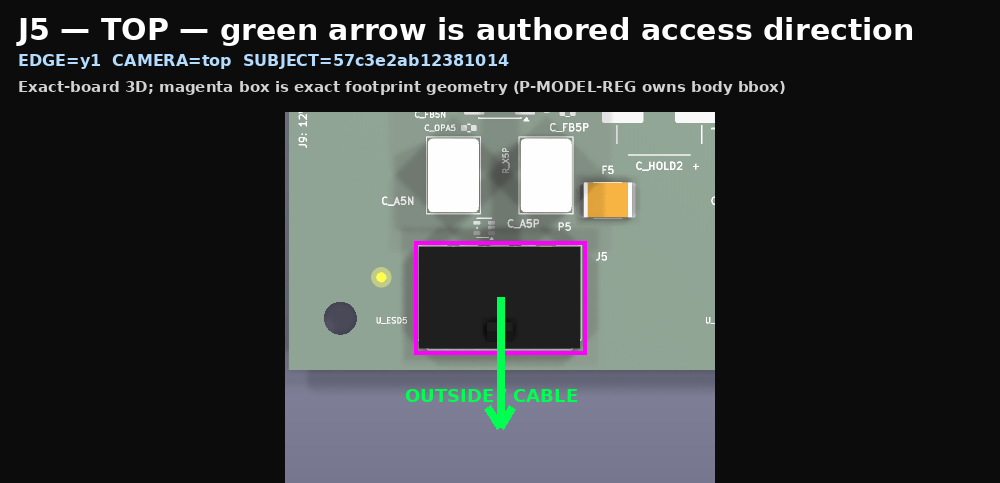 | 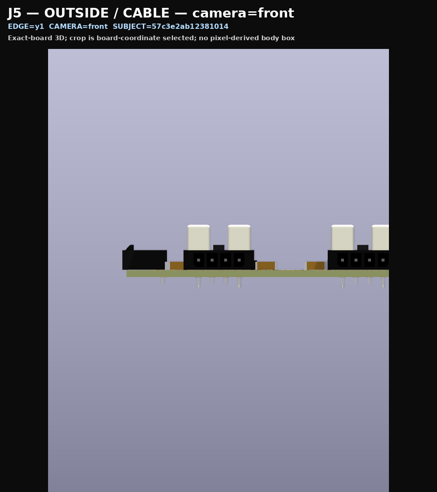 |  |

**MEASURED — west input, J9:** two contact openings face west; the inside camera shows the rear shell. The mating plane projects 0.92 mm beyond the board edge.

| Top | Cable side | Rear |
|---|---|---|
| 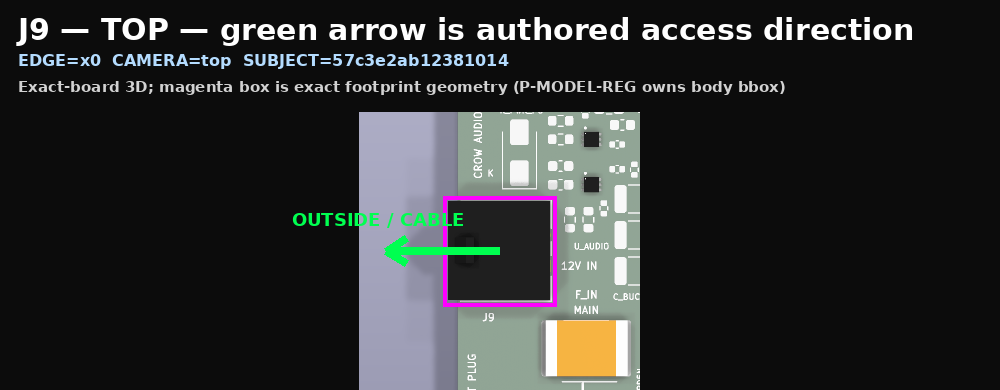 | 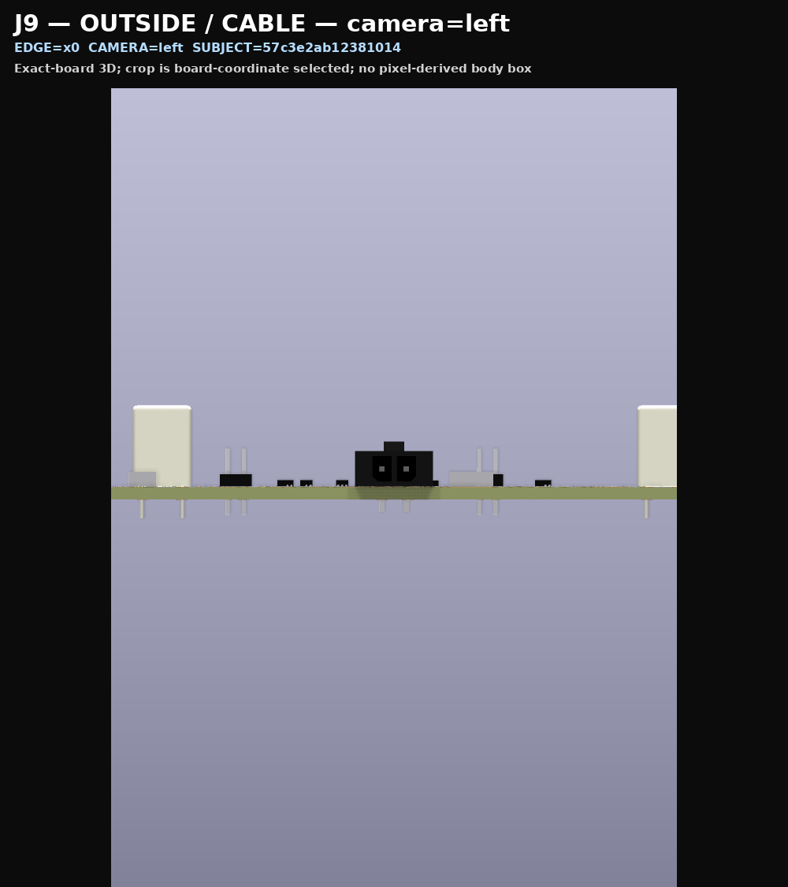 | 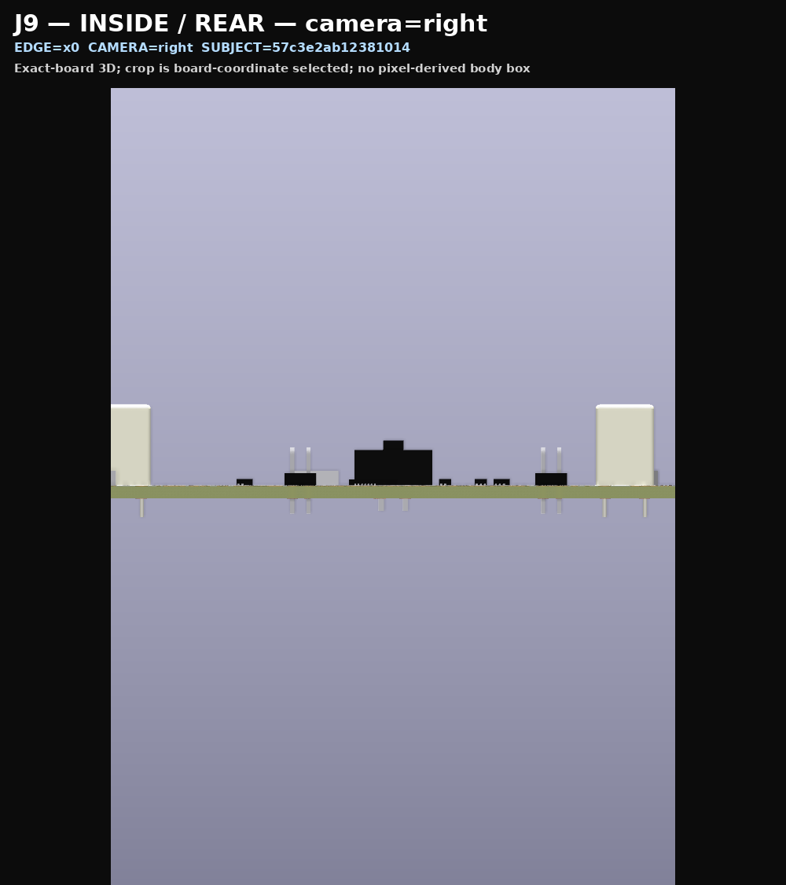 |

| J9 profile from south | J9 profile from north |
|---|---|
| 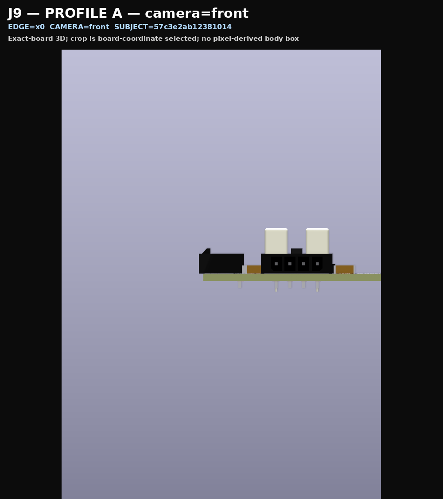 | 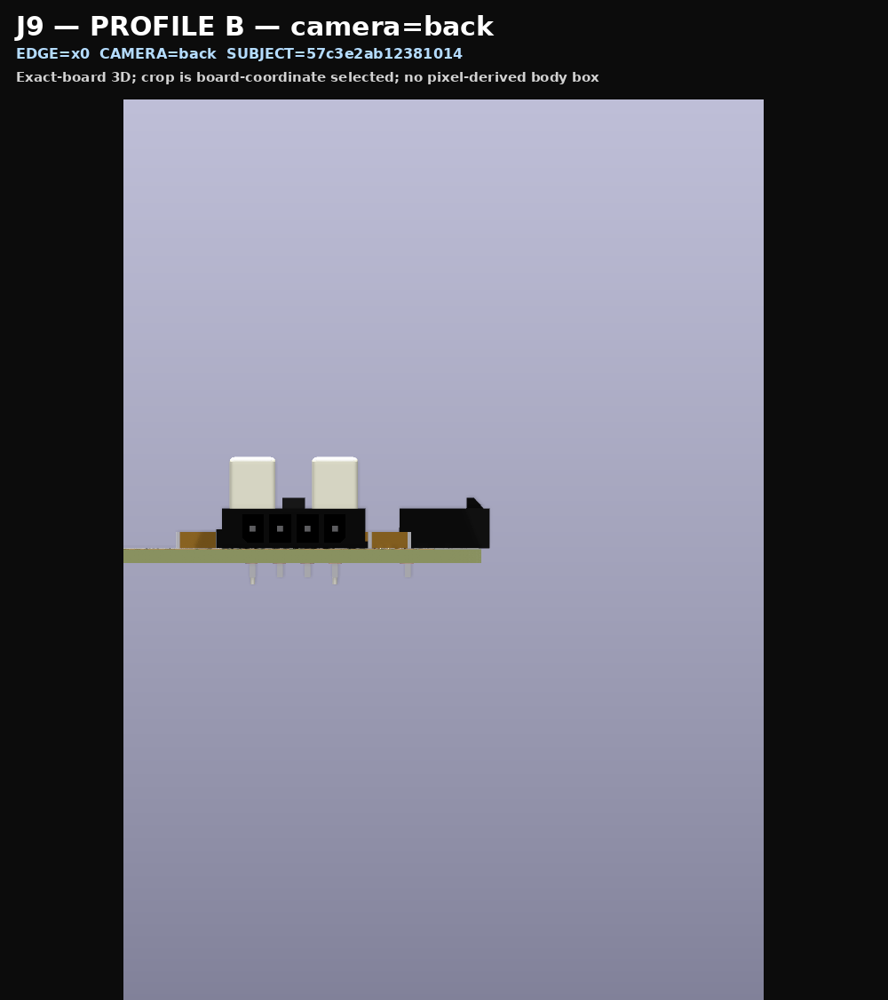 |

**INFERRED:** these native views are adequate to present the orientation decision. Only the user's explicit confirmation can close the human half of the gate. Machine passes and this report's REVIEWED status do not supply that decision.

## Recommendations

**PROPOSED:** confirm the three edge approaches and the visible top-mounted/keyed housings, or identify the connector and required correction. After approval, record it through the owning gate and continue the independent placement reviews. Routing and release remain subsequent gates.

## Validation plan

**MEASURED:** all eleven standard image hashes were checked against the owning receipt, both supplemental images were bound to the exact same board/receipt, and every report copy was rehashed. **OWED:** explicit human decision; the gate must subsequently validate its exact approval subject, references and image hashes. Changed placement, models, direction contract or evidence require a new decision.

## Source register

- [Image manifest](assets/2026-09-11-connector-orientation/image-manifest.csv): exact image, board and orientation identities.
- [Model-registration source](../../03_src/rules/model_registration.yaml) and [model authority](../../03_src/lib/3dmodels/provenance.md).
- [Placement journal](../journal/placement.md): actual gate stop, preserved runtime evidence and remaining scope.
