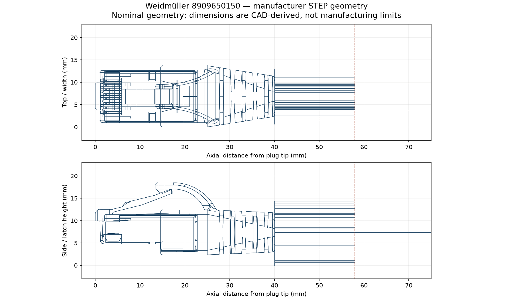

## Executive conclusion

**PROPOSED:** Evaluate Weidmüller **8909650150**, type **IE-C6ES8UG0150A40A40-E**. Its exact product page supplies a downloadable STEP model and six DXF views. The complete modeled end occupies **57.98 × 13.70 × 18.46 mm** (axial length × width × height), including the rear sleeve and raised latch. This supplies inspectable geometry for clearance work; manufacturing limits and design acceptance remain owed.

## Question and scope

Find another factory RJ45 plug/cord with dimensions for the approved Cat cable analog-audio/power connection to pods. This is a sourcing investigation for the held RJ45 draft, not an Ethernet or PoE design change.

## Evidence boundary

Baseline `f7c868fb`; live engineering source and generated board remain unchanged. Primary STEP bytes were opened using OCCT, with numerical face bounds and native edge projections. These are **INFERRED** nominal CAD dimensions, not **MEASURED** hardware or a toleranced drawing. The product links a family model internally named `8909650000`; its shortened cable is not the actual 15 m length. The DXFs contain CAD views; a toleranced manufacturing drawing was not established.

## Findings

| Evidence | Finding | Implication |
|---|---|---|
| **DATASHEET** | Factory 15 m, shielded RJ45 male both ends; Cat6A, S/FTP AWG26/7, PUR | Matches the intended cord format |
| **DATASHEET** | Operating −40…80 °C; installation −15…60 °C | Covers the existing operating-temperature range; installation is a separate condition |
| **DATASHEET** | Cable diameter 6.1…6.5 mm; pair-loop resistance 290 Ω/km | Supplies explicit OD limits and resistance |
| **INFERRED** | Existing power model gives 2.1125 Ω hot loop and 10.58875 V at the pod | Fits the 2.2 Ω / 10.5 V design budget with its unmeasured contact allocation |
| **INFERRED** | Complete end 57.98 × 13.70 × 18.46 mm; plug/boot axial extent about 39.98 mm, then 18 mm rear sleeve | Include the full modeled end in first clearance checks; do not omit the sleeve based on its accessory-like appearance |
| **OWED** | Exact UV evidence, explicit straight-through pair/color mapping, tolerance treatment, mated envelope and service/grip clearance | Candidate has not passed SOURCE |

Power calculation uses the existing three parallel power pairs: `290 × 0.015 / 3 × 1.25 + 0.300 = 2.1125 Ω`; at 0.100 A and 10.8 V, `10.8 − 0.100 × 2.1125 = 10.58875 V`. The 0.300 Ω combined contact allowance is not a measured cord specification.

The figure projects manufacturer BREP edges and includes hidden edges. Dimensions come from exact face bounding boxes after STEP transfer, not from measuring pixels. Whole model length is 279.96 mm with a 200 mm cable placeholder. First-end faces ending below Z=100 mm exclude the central cable cylinder; their combined axial maximum is 57.98 mm. Numerical kernel tolerances are not manufacturing tolerances.

## Recommendations

1. Use this exact candidate for the next source/clearance investigation. Bind the manufacturer's model to Würth 615008160221 and both enclosures; its latch and rear sleeve need actual space.
2. Resolve the remaining primary-source UV and wiring facts before adoption. Keep missing tolerances explicit and apply the existing contract's source/physical distinction.
3. After accepted source integration, follow existing carrier ADR-0007: represented physical FULL INCOMPLETE may accompany prototype placement/routing/design release after SOURCE success. A mandatory coupon or renewed user approval is not introduced by this report.

## Validation plan

Reopen the retained model hash, verify the exact-product binding, and independently check mated geometry, latch access and bend/grip envelope. A collision, incompatible wiring or unsupported environmental requirement rejects this candidate. Rerun the owning source gates after source changes and obtain the required fresh review. On the first assembled prototype, validate fit and finished hot-loop resistance; these later physical tests do not automatically become prerequisites for authorized prototype work.

## Source register

- [Manufacturer product and specifications](https://eshop.weidmueller.com/en/ie-c6es8ug0150a40a40-e/p/8909650150).
- [Manufacturer five-page datasheet](https://datasheet.weidmueller.com/pdf/en/8909650150/scope/2/), generated 2026-02-18; pages 2–3 electrical, environmental and cable facts. Browser extraction succeeded; direct local PDF/HTML retrieval returned HTTP 403 and no local PDF is claimed.
- [Exact-product CAD downloads](https://eshop.weidmueller.com/en/ie-c6es8ug0150a40a40-e/p/8909650150/downloads); STEP SHA-256 `2fa7f4e4927997e2473fd8627d8a2baeb2050a451b88797f61f4bfd016ddfe1a`, CATIA export 2025-11-19.
- [Retained source and analysis bundle](../journal/f25d1606c0c0084f4c333baee75f54b8778119600e034c94b892c296060cea2a.tar.gz): 1,269,922 bytes; 41 regular payload members plus MANIFEST.json, all reopened. Contains native STEP, original DXF ZIP and six extracted views, geometry JSON, plotted evidence, URLs/hashes and raw retrieval/analysis outcomes including failures. Figure provenance is its `README.md` and `plug-views.png`.
- [Accepted prototype timing](../decisions/0007-prototype-before-physical-qualification.md) and [prior held-source checkpoint](../research/2026-09-12-rj45-source-checkpoint.md).
