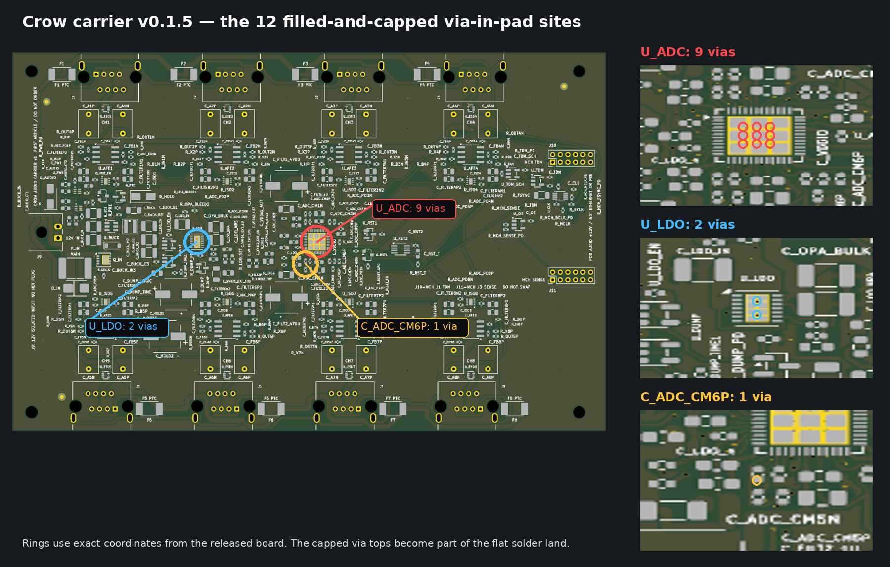

## Executive conclusion

The immutable carrier release is suitable for a supervised five-board
first-article order after the live uploader checks below pass. **MEASURED:** its
board and fabrication payload remain DRC-clean at 0 violations, 0 unconnected
items and 0 schematic-parity findings. **MEASURED:** its assembly boundary is a
partial PCBA: JLC places 300 top-side references per board and 33 physical
references per board are fitted afterward. A carrier assembled from the JLC
BOM/CPL alone is intentionally incomplete and cannot function without U_ADC.

The three order-critical risks are closed by explicit controls rather than
assumed away: exact final population reconciliation, BOM/rotation preview
acceptance with no substitutions, and CAM confirmation of precisely twelve
epoxy-filled and copper-capped via-in-pad sites.

## Question and scope

This report answers whether release
[`v0.1.6-2026-09-16`](../../07_releases/v0.1.6-2026-09-16/ORDER_README.md)
can be used for the first five carrier boards and what must be checked before
payment. It covers bare-PCB selections, partial JLC assembly, the subsequent
manual-fit work order and the first-order uploader review. It does not claim
that fabricated hardware has passed electrical, thermal, cable or environmental
qualification.

## Evidence boundary

**MEASURED:** the release board SHA-256 is
`0776f364424282a7924266450f899ce69bf28cf95a602ca74d92b86fd91c164d`.
The exact upload artifacts are:

| Slot | Immutable file | SHA-256 |
| --- | --- | --- |
| PCB | [`crow_audio_carrier_v1_gerbers.zip`](../../07_releases/v0.1.6-2026-09-16/fab/crow_audio_carrier_v1_gerbers.zip) | `c8c865812d35b9d37a28b44470dd3e7b4214bf4779213fe2449e2adad96976d1` |
| BOM | [`bom.csv`](../../07_releases/v0.1.6-2026-09-16/fab/bom.csv) | `5661aef990441718b44f18236222df7f0a8a2f1aebce30877b1606a9e4fbc8c8` |
| CPL | [`cpl.csv`](../../07_releases/v0.1.6-2026-09-16/fab/cpl.csv) | `29c8674108ef9d5ad70739d4635c7ae0794bd258386a9ada93d198c2fc92a58a` |

**OWED:** JLC's resolved BOM table, final price/allocation, placement preview
and CAM production files do not exist until the authenticated uploader session.
They cannot be inferred from public stock observations.

## Findings

### Frozen fabrication profile

**PROPOSED and accepted by ADR0032:** use JLCPCB Standard PCBA, quantity five,
FR-4, four layers, 1.6 mm finished thickness, JLC04161H-7628, 1 oz outer and
0.5 oz inner copper, green solder mask, white silkscreen and ENIG 1 microinch.
Select controlled impedance to bind the named stack while retaining the
submitted artwork. Select production-file confirmation.

**CITED:** JLC describes ENIG as its planar finish for fine-pitch packages and
lists green mask with the tightest ordinary mask-bridge capability. Its public
four-layer impedance table identifies JLC04161H-7628 with 0.21040 mm 7628
prepreg and 0.0152 mm inner copper.

### Risk 1 — incomplete automated population

**MEASURED:** [`assembly_coverage.txt`](../../07_releases/v0.1.6-2026-09-16/verification/assembly_coverage.txt)
reports 340 footprints, 300 CPL placements, 33 declared exclusions and seven
mechanical/test-point exemptions. It reports 306 fitted SMD bodies, all on the
top side; six of those SMD bodies are in the manual-fit set.

**MEASURED:** the [manual-fit work order](assets/carrier-manual-fit-work-order.csv)
contains all 33 physical exclusions per board: U_ADC, F_IN, four electrolytics,
sixteen film capacitors and eleven connectors. For five boards this is 165
manual placements. U_ADC requires controlled QFN reflow or hot-air work and
exposed-pad inspection; an ordinary soldering iron alone is not an adequate
assembly method.

**OWED:** before first power, reconcile each serialized carrier to 300 JLC
placements plus all 33 work-order references. Missing U_ADC is a hard stop.
Before payment, also confirm how the six excluded SMD references are handled by
the assembly stencil. Their pads must either be protected from paste during
JLC reflow or accepted by the qualified manual assembler for cleanup and
subsequent rework; do not assume those lands will arrive pristine.

### Risk 2 — rotation or substitution

**MEASURED:** the release's
[`rotation_human_gate.txt`](../../07_releases/v0.1.6-2026-09-16/fab/rotation_human_gate.txt)
names 21 carrier placements: U_RST2, U_CLK, U_BUCK, U_AFE1–U_AFE8,
U_ISO1–U_ISO8, U_LDO and D_HOLD. This corrects the earlier informal count of
twenty. **OWED:** every one must be checked in JLC's final placement preview.

**OWED:** save JLC's resolved BOM table and compare every row to
[`bom_echo_gate.txt`](../../07_releases/v0.1.6-2026-09-16/fab/bom_echo_gate.txt).
Any redirected LCSC code, different MPN, unresolved row or automatic
substitution stops payment. Manually fitted polarized and pin-1 parts receive a
second inspection under the work order.

### Risk 3 — wrong filled/capped-via processing

**MEASURED:** the release grades 601 vias as 12 protected, 589 ordinary and
zero partially classified. The protected set is nine sites under U_ADC EP49,
two under U_LDO EP15 and one in C_ADC_CM6P pad 2. The exact order remark is
[`order_notes.txt`](../../07_releases/v0.1.6-2026-09-16/fab/order_notes.txt).

**CITED:** JLC's via-covering instructions support epoxy-filled and capped
via-in-pad holes in this size range and specifically request a diameter or
annotated image plus production-file confirmation. **OWED:** the CAM preview
must show epoxy fill and copper cap on only the 0.30 mm drill family. All 589
0.20 mm drill vias and every component lead hole must remain ordinary.

## Recommendations

1. Upload only the three hash-listed release files. Benefit: prevents mixing a
   current board with an earlier BOM/CPL. Tradeoff: none.
2. Order the partial PCBA only if qualified QFN rework/manual assembly is
   available for the 33-reference work order. Benefit: the other 300 references
   are machine placed. Tradeoff: 165 manual placements across the lot remain,
   and the six excluded SMD land patterns require an agreed stencil/rework plan.
3. Paste the generated via remark and attach the annotated image. Benefit:
   gives CAM both drill-family and location authority. Tradeoff: adds the
   standard via-fill/cap process charge.
4. Stop at any mismatched BOM row, any of the 21 rejected preview rotations,
   any bottom-side fitted component, or any CAM interpretation other than
   twelve protected and 589 ordinary vias.

## Validation plan

Before payment, retain screenshots or exports of the final fabrication
selections, resolved BOM, 21-placement review and CAM via interpretation. Hash
the uploader artifacts and bind them to this release in an order receipt. After
delivery, inspect every manual placement and follow
[`FIRST_ARTICLE_TEST_PLAN.md`](../FIRST_ARTICLE_TEST_PLAN.md). These checks can
falsify the order-ready conclusion if JLC redirects a part, cannot implement
the selective via process, or the manual QFN assembly path is unavailable.

## Source register

- [Immutable carrier manifest](../../07_releases/v0.1.6-2026-09-16/MANIFEST.txt)
- [Assembly population evidence](../../07_releases/v0.1.6-2026-09-16/verification/assembly_coverage.txt)
- [Selective via-process evidence](../../07_releases/v0.1.6-2026-09-16/verification/via_process.json)
- [Order-profile authority](../decisions/0032-first-article-order-profile.md)
- [JLCPCB surface-finish guide](https://jlcpcb.com/help/article/jlcpcb-surface-finish)
- [JLCPCB controlled stackups](https://jlcpcb.com/impedance)
- [JLCPCB via-covering instructions](https://jlcpcb.com/help/article/pcb-via-covering)
